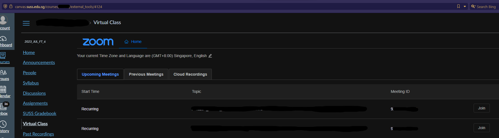

# canvas_zoom_bot
WORK IN PROGRESS <br><br>
Python script to automate joining of zoom meetings via canvas  
Features:
- Logs in to canvas and launches zoom automatically when meeting time is reached
- Basic functionality to occasionally send messages for participation

## Setup:
- Ensure you have python installed
- Install required dependencies
```
pip install -r requirements.txt
```

## Get Zoom Meeting Details: 
Navigate to "Virtual Class" page on canvas

Fill in csv file with zoom meeting details. See Sample below
- Compulsory Fields:
  - datetime
  - url
  - meeting_id
## Sample csv format

datetime      | url            | meeting_id
------------- | -------------  | ------------
26/01/2023 12:00 | https://canvas.suss.edu.sg/courses/12345/external_tools/4124 | 12345678912
30/01/2023 08:30 | https://canvas.suss.edu.sg/courses/12345/external_tools/4124 | 12345678912


## How it works:
```
python zoombot_test.py
```
1. Run program, program will continue running in the background.
2. When current time matches one of the meeting timings provided in the csv, program will launch canvas and launch zoom automatically.
3. Zoom Window will open and meeting chat opens automatically.
4. When the same message is detected in the chat 10 times, program will automatically send that message to the chat.

## Notes
- launch_only.py only launches zoom for you, and will not trigger the chat sending functionality.
- i would use zoom api but the school account doesnt allow access